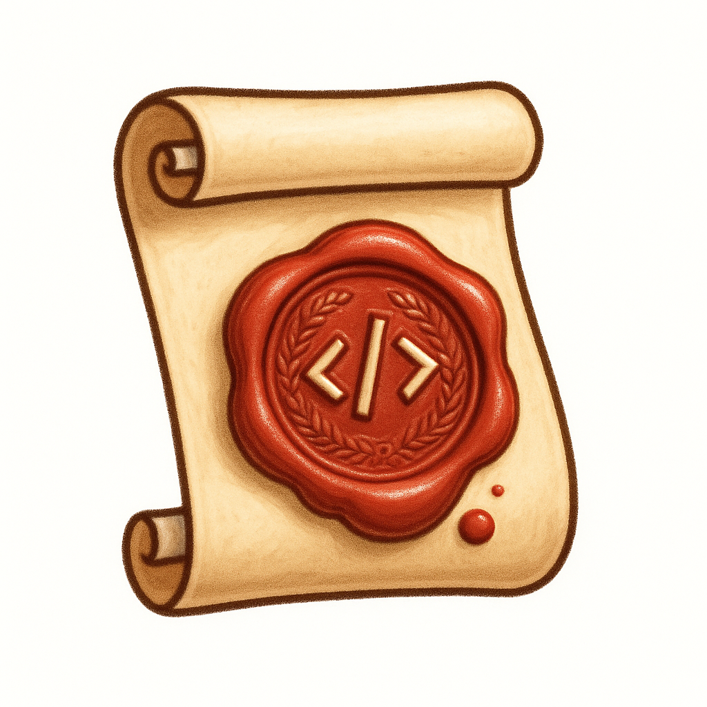

# Sigilla



_Form validation with the stamp of correctness_

**A form validation library that pairs well with React Router 7. Focused on type-safety and simplicity.**

## Release

Releases publish to npm from GitHub Actions when a version tag is pushed.

### One-time npm trusted publishing setup (OIDC)

1. On npm, open package settings for `sigilla` and enable Trusted Publisher.
2. Configure publisher:
   - Owner: `nickpad`
   - Repository: `sigilla`
   - Workflow file: `.github/workflows/release.yml`
   - Environment: leave empty (unless you later add a GitHub environment gate)
3. No `NPM_TOKEN` GitHub secret is needed.

### Release steps

1. Bump `package.json` version.
2. Commit the version change.
3. Tag and push:

```bash
git tag v0.0.1
git push origin main --tags
```

The release workflow verifies the tag equals `package.json` version, runs build/lint/typecheck/tests, publishes to npm, and creates a GitHub release.
